# Slack Emojis 

> These are emojis I've collected or created over the years to truly communicate on Slack.

## Emoji Collection

| Name | Emoji |
|------|-------|
| :100: |  |
| :acknowledged: | 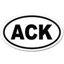 |
| :afk: |  |
| :ahhh-scary: | 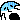 |
| :are-you-kidding-me: | 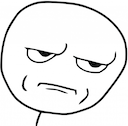 |
| :atlassian-fire: |  |
| :awesome-rolling: |  |
| :awesome: |  |
| :aww-yeah: |  |
| :boo-ghost-animated: | 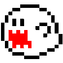 |
| :boom: |  |
| :celery-man-animated: | 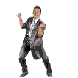 |
| :chatgpt: |  |
| :checked-animated: |  |
| :checked: |  |
| :chompy: | 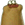 |
| :clown-face: |  |
| :confused-dog: |  |
| :deployed: |  |
| :face-palm: |  |
| :face-palm02: |  |
| :feelsgood: |  |
| :gandalf-nod: |  |
| :gandalf-parrot: |  |
| :hacker-man: |  |
| :high-five-animated: |  |
| :hmmm-yes: |  |
| :i-see-what-you-did-there: | 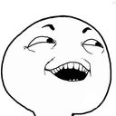 |
| :interesting: |  |
| :keanu-thanks: |  |
| :kevin-r: |  |
| :kids: |  |
| :letsgo: | 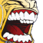 |
| :lol: | 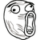 |
| :lolsob: |  |
| :muscle-right: |  |
| :neovim: |  |
| :nerd: |  |
| :nextjs: | 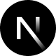 |
| :nice: |  |
| :nod: |  |
| :oof: | 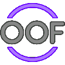 |
| :pants-on-fire: | 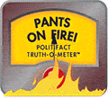 |
| :parrot-coffee: | 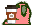 |
| :parrot-dad: |  |
| :parrot-deal-with-it: |  |
| :parrot-everything-is-on-fire: | 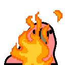 |
| :parrot-party-conga: |  |
| :parrot-party: |  |
| :parrot-ultra-fast: |  |
| :point-up: |  |
| :remix: |  |
| :rolling-on-the-floor-laughing: | 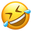 |
| :rust-lang: |  |
| :sad-cloud: |  |
| :scream: |  |
| :slack-intensifies: |  |
| :slack-old-man-yells-at: | 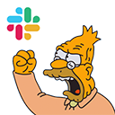 |
| :slack: |  |
| :slow-clap: |  |
| :terminator: | 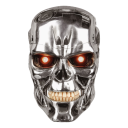 |
| :test-tube: | 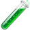 |
| :thank-you: |  |
| :this-is-fine-animated: |  |
| :this-is-fine-fire: | 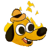 |
| :this-is-the-way: |  |
| :this-right-here: |  |
| :this: |  |
| :troll-face: |  |
| :true-story: |  |
| :twitching-eye: |  |
| :upvote: |  |
| :yes: |  |
